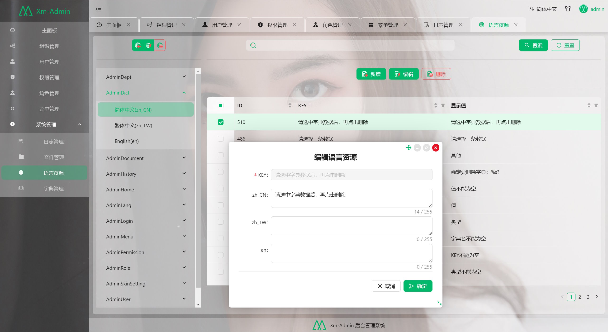

<h2 align="center">Xm.Admin 后台管理系统</h2>
<h4 align="center">基于jfinal + react18/Antd5 通用后台管理系统</h4>

<h2 style="color:red;">vue3版本正在开发中，详细见codebase/admin-vue3</h2>

# ✨概述
- 面向中小企业快速开发平台框架，框架采用主流技术开发设计，前后端分离架构模式，后端采用java8(jfinal框架),前端采用react18(Antd5)，下一步计划开发vue3版本的
- 本系统完成了基本的权限体系，支持session,jwttoken,无状态三种模式，日志功能，字典，文件管理，等基本的管理功能，可以快速用于实际业务开发
- 本系统采用redis缓存服务，可以根据需要快速实现分布式部署
- 本系统抽离已有项目，经受了近亿数据量的业务压力
- 本系统注释详细，简单易懂，上手就能用，在一些起奇怪的代码处有详细的注释
- 后端框架不选spring的原因，一个是大部分的需求都是伪需求用不到这么复杂的框架，另一个是spring的ruoyi已经做的很好了没必要重复造轮子，jfinal用作者的话就是快速上手，易于开发和维护，根据本人从接触jfinal到现在也有7，8年的时间，jfinal基本能满足我能接触的所有项目，有特别需求的当我没说，技术无对错，根据自己的需要来选择就好。
- 本系统采用MIT开源协议

# &#x1F31F;亮点
- 多语言：多语言存入数据库，后台可以直接修改，不用因为文本显示不对而重新修改代码来部署；
- 高性能：redis缓存、支持集群部署；
- 个性UI：支持自定义主题，自定义背景，全局设置组件外观
- 自定义弹窗：支持最大化，缩小，移动，多窗体。
- 前后端分离：后端jfinal，管理端antd5；
- 代码规范：遵循PSR-2命名规范、Restful标准接口、代码严格分层、注释齐全、统一错误码；
- 权限管理：内置多种鉴权方式，支持多角色，支持数据权限控制，灵活控制每一个用户，每一条数据
- 快速上手：得益于jfinal的便捷，React的规范，可以快速上手着手业务开发
  
# &#x1F389;效果展示
<table>
    <tr>
        <td></td>
        <td></td>
        <td></td>
        <td></td>
    </tr>
    <tr>
        <td></td>
        <td></td>
        <td></td>
        <td></td>
    </tr>
    <tr>
        <td></td>
        <td></td>
        <td></td>
        <td></td>
    </tr>
</table>

# &#x26A1;快速开始
## 本地开发
### 数据库
- 安装mysql5.7，由于是基础项目，sql脚本并不复杂，自己可以使用任意数据库
- 导入resources/script.sql到数据库
### 后端
- 安装redis，并运行，具体方法自行百度
- 导入maven项目codebase/server到eclipse/idea中
- 默认redis是采用的无密码的连接方式，线上一定要设置密码
- 打开：/src/main/resources/config.properties修改数据库连接
- 运行XmAdminLanucher.java里面的main方法

### 前端
- 环境需求：node20.8.1
- 建议用vscode打开前端项目，前端项目位于：codebase/admin
- 运行npm install 
- 运行npm start

[更多文档](./doc/文档列表.md)