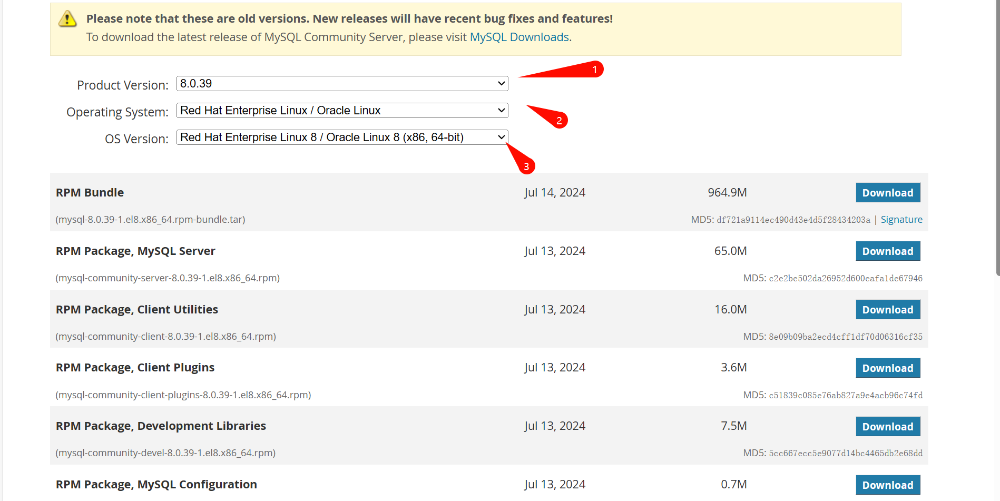

##  centos8 下面安装mysql8


## 这个操作非常丝滑，中间没报任何错误。

### 下载

地址：https://downloads.mysql.com/archives/community/



- 选择版本号
- centos 选择RedHat 系统，选这个安装包是因为安装后会生成配置文件:/etc/my.cnf
- 根据操作系统来选者32位还是64位
- 点击下载，复制下载链接


```bash
# 下载到opt目录
cd /opt/
wget https://cdn.mysql.com/archives/mysql-8.0/mysql-8.0.39-1.el8.x86_64.rpm-bundle.tar

# 解压
tar -xvf mysql-8.0.39-1.el8.x86_64.rpm-bundle.tar

# 安装依赖包openssl-devel
yum install -y openssl-devel

# 按顺序安装
rpm -ivh mysql-community-common-8.0.39-1.el8.x86_64.rpm
rpm -ivh mysql-community-client-plugins-8.0.39-1.el8.x86_64.rpm
rpm -ivh mysql-community-libs-8.0.39-1.el8.x86_64.rpm
rpm -ivh mysql-community-client-8.0.39-1.el8.x86_64.rpm
rpm -ivh mysql-community-icu-data-files-8.0.39-1.el8.x86_64.rpm
rpm -ivh mysql-community-devel-8.0.39-1.el8.x86_64.rpm
rpm -ivh mysql-community-server-8.0.39-1.el8.x86_64.rpm

# 查看是否安装成功
mysql --version

# 修改配置文件， 这里建议修改字符集，设置默认引擎为innodb，添加sqlmode支持mysql5的那种groupby
vim /etc/my.cnf
# 添加如下配置，见附录1

# 重启mysql 
systemctrl restart mysqld

# 设置为开启启动
systemctrl enabel mysqld

# 查看是否重启成功
systemctrl status mysqld

# 查看默认登录密码
cat /var/log/mysqld.log  | grep root@localhost

# 连接mysql, 修改登录密码, 这里注意：mysql默认开启了一个密码强度策略，改的密码必须包含大小写和数字，符号
mysql -uroot -p
alter user root@localhost identified by '%DBu113';

# 开启root 远程链接
use mysql;
update user set host='%' where user='root';
flush privileges;


```


### 附录1

```ini
[mysqld]
# 兼容mysql5.7的groupby
sql_mode='STRICT_TRANS_TABLES,NO_ZERO_IN_DATE,NO_ZERO_DATE,ERROR_FOR_DIVISION_BY_ZERO,NO_ENGINE_SUBSTITUTION'
# 服务端使用的字符集默认为UTF8
character-set-server=utf8mb4

# 创建新表时将使用的默认存储引擎
default-storage-engine=INNODB

[mysql]
# 设置mysql客户端默认字符集
default-character-set=utf8mb4

[client]
# 设置mysql客户端连接服务端时默认使用的端口和默认字符集
port=3306
default-character-set=utf8mb4
```

